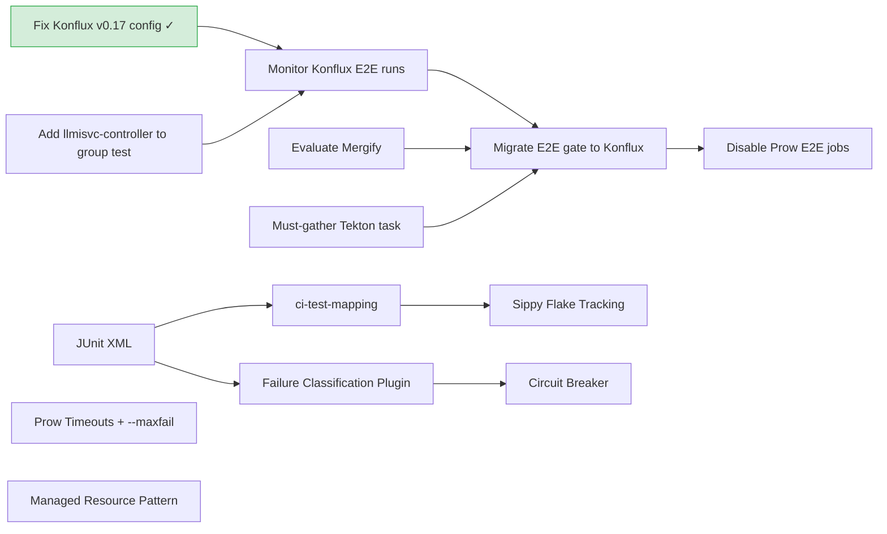

# Spike: CI Stability Improvements for Model Serving (kserve / odh-model-controller)

## Goal

The ODH Platform team produced a [Strategic Plan: ODH CI and E2E Test Stability Improvements](https://docs.google.com/document/d/1IM4YWMXsV3gxF0xZ8CxbxVJTmmezpXCLt5ISpApqh2M/edit?tab=t.j0cnd4pulzkb) targeting the opendatahub-operator E2E test suite. That plan is thorough and data-driven, but its scope is explicitly limited to the operator repo.

This document uses that plan as a starting point to **identify which recommendations are actionable for the model serving repos** (kserve and odh-model-controller). For each area we assess:

1. **Applicability** -- does the problem exist in our CI, or is it operator-specific?
2. **Ownership** -- will the operator team's work fix it for us, or must we act independently?
3. **Priority** -- what is the realistic benefit relative to the effort, and what depends on what?

## Context: How Model Serving CI Differs from ODH Operator CI

The strategic plan targets **opendatahub-operator**, which uses Go/Ginkgo E2E tests, GCP IPI cluster provisioning (now migrated to Hive cluster pools on `main`), and the `optional-operators-ci-operator-sdk-gcp` workflow. Model serving CI differs in every dimension:

- **Cluster provisioning**: Hypershift hosted clusters on AWS (`hypershift-hostedcluster-workflow`), not IPI/GCP or Hive pools. The plan's P0 recommendation (Hive cluster pool migration) may be directly applicable -- our Hypershift provisioning has a 54% failure rate (see [Failure Classification](#failure-classification)). The ODH operator team tried HyperShift and reverted it, then migrated to Hive cluster pools. See [Section 1](#1-cluster-provisioning-reliability) and [cluster-provisioning-reliability.md](cluster-provisioning-reliability.md) for full analysis.
- **Test framework**: Python pytest (with pytest-xdist parallelism), not Go/Ginkgo
- **Workflow**: `hypershift-hostedcluster-workflow` with custom pre/post chains
- **Shared Boskos pool**: `aws-opendatahub` (not `gcp-opendatahub`)
- **Test runner**: `test/scripts/openshift-ci/run-e2e-tests.sh` -> `gh-actions/run-e2e-tests.sh` -> pytest
- **Test selection**: Marker-based (`-m "predictor or kserve_on_openshift"`, etc.), not separate test directories. Tests marked `kserve_on_openshift` run only in OpenShift CI.

### Test Infrastructure Layers (upstream vs ODH fork)

The document's ownership assessments depend on understanding which code layer a change touches. kserve has a three-tier fork hierarchy (upstream `kserve/kserve` -> ODH `opendatahub-io/kserve` -> downstream `red-hat-data-services/kserve`), and the test infrastructure spans four layers with different ownership:

| Layer | Location | In upstream kserve? | Community buy-in? |
|---|---|---|---|
| Prow CI configs | `openshift/release` | No | No |
| OpenShift CI scripts | `test/scripts/openshift-ci/` | No (ODH fork only) | No |
| Shared test runner | `test/scripts/gh-actions/run-e2e-tests.sh` | Yes | Yes, or carry as ODH fork patch |
| Test code | `test/e2e/` (marker-selected) | Mostly yes | Yes for shared tests; No for `kserve_on_openshift` tests |

The OpenShift CI wrapper (`test/scripts/openshift-ci/run-e2e-tests.sh`) delegates to the shared GH Actions script, so changes like `--junitxml` or `--maxfail` can either be proposed upstream in the shared script or injected from the ODH wrapper without upstream involvement. The `setup-e2e-tests.sh` script is entirely ODH-fork-only.

---

## Data Analysis

### CI Timing Data

Data collected from **490 recent Prow builds** across all 6 E2E job types (4 kserve, 2 omc) using [`collect_ci_timing.py`](collect_ci_timing.py). Full raw data: [`ci_timing_data.csv`](ci_timing_data.csv).

> **Note:** `e2e-llm-inference-service` is excluded from aggregate statistics below. This job was recently added and is still being stabilized -- it has a 2% success rate (1/42 completed), dominated by `test:collection` errors (broken imports/fixtures). Its failures skew the aggregate and are not representative of the established CI jobs. Per-job data is retained in [`ci_timing_summary.md`](ci_timing_summary.md) for reference.

Of 419 builds (excluding llm), 218 completed (non-aborted). **Overall success rate: 37%** (81/218).

| Job type | N | Success rate | Total (median) | Pre-test (median) | Test (median) | Post-steps (median) |
|---|---|---|---|---|---|---|
| e2e-predictor | 46 | 28% | 1h38m | 29m | 25m | 35m |
| e2e-graph | 46 | 46% | 1h37m | 31m | 32m | 35m |
| e2e-raw | 50 | 52% | 1h19m | 31m | 21m | 33m |
| e2e-odh-kserve (omc) | 33 | 33% | 1h02m | 18m | 9m | 21m |
| e2e-odh-llmisvc (omc) | 43 | 23% | 1h28m | 22m | 32m | 24m |
| **Aggregate** | **218** | **37%** | **1h24m** | **29m** | **23m** | **32m** |

**Key observations:**

- **Pre-test phase (ci-operator overhead + Hypershift provisioning)** accounts for a median of 29 minutes. Hypershift cluster creation itself is ~11-13 min; the rest is ci-operator initialization, image builds, and OLM wait. P90 is ~1h, P99 is ~2h -- outliers are driven by resource contention in the shared `aws-opendatahub` Boskos pool.
- **Post-steps (must-gather + cluster destroy)** account for a median of 32 minutes and run on every job, even successes. Adding `allow_skip_on_success: true` would save most of this time on green runs (cluster destroy still runs, but must-gather would be skipped).
- **Test execution** median is 23 minutes, but P90 is 1h and P99 is 2h -- indicating tests frequently hit cascading timeouts on degraded clusters rather than failing fast.

Full percentile breakdown: [`ci_timing_summary.md`](ci_timing_summary.md).

### Failure Classification

Build logs (`build-log.txt`) were fetched for all 138 FAILURE builds (excluding llm) and classified by regex pattern matching against known failure signatures. Logs are cached locally in `logs/` for iterative analysis. Method: [`collect_ci_timing.py --help`](collect_ci_timing.py).

Failures are classified into three domains:

- **Platform** (out-of-domain): CI infrastructure issues outside our control -- cluster provisioning failures, CI image problems, Hypershift timeouts
- **Setup** (in-domain infra): our component installation or configuration failing -- CRD timeouts, webhook errors, kustomize path mismatches
- **Test**: actual test code failures -- assertion errors, fixture problems

**Overall: 62% platform, 7% setup, 31% test.**

| Category | Count | % | What it means |
|---|---|---|---|
| `platform:provision` | 74 | 54% | Hypershift cluster creation failed (HTTP 400, timeout on hostedclusters/clusterversions) |
| `test:assertion` | 38 | 28% | `assert` failures or `FAILED test_*` in pytest output |
| `platform:ci-infra` | 9 | 7% | CI infrastructure bug (jq credential error, missing binary in CI image) |
| `setup:install` | 7 | 5% | KServe CRD not establishing, controller webhook failure, component readiness timeout |
| `test:other` | 5 | 4% | Test ran to completion, no specific pattern matched |
| `setup:config` | 2 | 1% | Kustomize path error, manifest apply failure (version/config mismatch) |
| `platform:cluster-health` | 2 | 1% | Node NotReady, cluster operator degraded |
| `platform:timeout` | 1 | 1% | Generic timeout (ambiguous, not attributable to a specific component) |

**kserve vs omc:**

| Repo | Platform % | Setup % | Test % | Dominant cause |
|---|---|---|---|---|
| kserve (3 jobs) | 60% | 7% | 33% | `platform:provision` (49%) -- Hypershift cluster creation |
| omc (2 jobs) | 65% | 5% | 29% | `platform:provision` (60%) -- Hypershift cluster creation |

**Notable findings:**

- **Provisioning is the #1 problem**: 54% of all failures are `platform:provision` -- Hypershift cluster creation failing with HTTP 400 or timing out. This is entirely outside our domain and accounts for more failures than all other categories combined.
- **Test assertions are the #2 problem**: 28% of failures are genuine test code bugs (`test:assertion`), concentrated in `e2e-predictor` (39% assertion rate) and `e2e-odh-llmisvc` (36%).
- **Setup issues are small but actionable**: 7% of failures are in-domain setup problems (`setup:install` + `setup:config`). These include CRD timeouts for `clusterstoragecontainers.serving.kserve.io` (7 builds), kustomize path errors from omc manifest misconfiguration (2 builds), and component health timeouts (1 build). These are directly fixable.
- **Previous misclassification corrected**: The earlier "78% infrastructure" figure was inflated by `connection refused` in kubelet diagnostic output being misclassified as network failures. After log-based pattern refinement, those 10 builds are correctly classified as `test:assertion`.

### Impact Analysis

Mapping each recommendation to the failure categories it addresses reveals a gap: the dominant failure mode has no recommendation.

| Recommendation | Addresses | % of failures | Verdict |
|---|---|---|---|
| Provisioning reliability | `platform:provision` | 54% | **NEW** -- [Section 1](#1-cluster-provisioning-reliability); highest potential impact |
| JUnit XML / ci-test-mapping | `test:*` (when tests run) | 32% | Valuable but only for failures where tests execute |
| `--maxfail` | Cascading test failures | Subset of 32% | Useful -- prevents xdist workers from burning parallel timeouts |
| Pre-flight health check | `platform:cluster-health` | 1% (2 builds) | **Overstated** -- addresses 1% of failures |
| `allow_skip_on_success` | Green runs only | 0% of failures | Saves CI time on successes, does not improve success rate |
| Prow timeout / build cache | P99 outliers | Saves CI time | Same -- resource savings, not failure prevention |
| Managed resource pattern | `test:*` (leaked resources) | Subset of 32% | Reasonable |
| Circuit breaker | Cascading failures on degraded clusters | ~1% | Correctly deferred |

Test-level recommendations collectively address at most 38% of failures (test + setup). The dominant 54% -- binary provisioning failures where the cluster is never created and tests never start -- cannot be addressed by any test-level mitigation. Section 1 addresses this gap by investigating the provisioning method itself.

---

## Recommendations

Based on the data above, five areas of action are identified, ordered by execution priority.

### 1. Cluster Provisioning Reliability

> **Applicability:** HIGH -- 54% of all failures are `platform:provision`, the single largest failure category
> **Ownership:** Mixed -- we choose the provisioning method; Hypershift reliability is the platform team's domain
> **Priority:** HIGH -- highest potential impact of any single change; no test-level mitigation helps when there is no cluster

54% of all failures are binary Hypershift cluster creation failures (HTTP 400, timeout on hostedclusters/clusterversions). The cluster is never created, tests never start, and no amount of `--maxfail`, health checks, or JUnit XML helps. This is the #1 contributor to the 37% overall success rate.

We currently use `hypershift-hostedcluster-workflow` with `cluster_profile: aws-opendatahub` (Prow). The `aws-opendatahub` Boskos pool is shared across 47 AWS E2E jobs from 26 repos, and the strategic plan found 21-percentage-point success rate swings by time of day -- strong evidence of contention. Model serving E2E pipelines also exist in Konflux ([odh-konflux-central](https://github.com/opendatahub-io/odh-konflux-central)), using the same test code but provisioning via Konflux EaaS (HyperShift on separate AWS infrastructure, no Boskos). EaaS provisioning has been measured at **100% success rate across 30 cluster provisions** -- 9/9 omc runs (18 provisions at 2-parallel) + 3/3 kserve group runs on `release-v0.15` (12 provisions at 4-parallel) -- conclusively confirming Boskos pool contention as the root cause. See [konflux-eaas-feasibility.md](konflux-eaas-feasibility.md).

**Ecosystem context (from `#wg-odh-e2e-stability`, March 2026):** The ODH operator team migrated to Hive cluster pools and achieved 67.5% success rate (vs our 37%), but `clusterClaimStep` pool exhaustion is still their #1 failure (289 failures/week). AWS lease pool exhaustion is also blocking OCP nightly payload releases (`#trt-alert`). Any provisioning method that draws from a shared Prow-managed pool is subject to the same systemic capacity constraints.

Full analysis of provisioning methods, HyperShift history, Konflux EaaS comparison, ecosystem Slack findings, and options: [cluster-provisioning-reliability.md](cluster-provisioning-reliability.md).

#### Options (ordered by effort)

1. **Collaborate with `#wg-odh-e2e-stability`** -- share our 54% provisioning failure rate data, coordinate with the ODH operator team's ongoing pool-sizing and CI stability work. Low effort, potentially high payoff.
2. **Evaluate Hive cluster pools** -- the ODH operator already uses `cluster_claim` with `owner: opendatahub`. Improves from 37% to ~67.5% but does not eliminate pool exhaustion. Medium effort.
3. **Migrate to Konflux EaaS** -- pipelines already exist, same test code, separate provisioning infrastructure (no Boskos). EaaS provisioning measured at **100% across 30 cluster provisions** (omc at 2-parallel + kserve at 4-parallel on `release-v0.15`). Pipelines active on both `release-v0.15` and `release-v0.17`. This solves provisioning *and* aligns with the strategic CI platform direction (RHAISTRAT-903). Medium effort. Full analysis: [konflux-eaas-feasibility.md](konflux-eaas-feasibility.md).
   - **Prerequisites** (from [feasibility analysis](konflux-eaas-feasibility.md#summary-of-objections), 21 objections evaluated, 0 blocking):
     - ~~Fix `release-v0.17` group test config~~ -- done; group test runs on `release-v0.17`
     - Add **llmisvc-controller** tests to Konflux group pipeline -- currently missing from group test coverage
     - Evaluate **Mergify** as Tide replacement -- highest-severity open gap; Prow's merge queue (auto-rebase, batch merge, stale-branch testing) is lost without it
     - Implement **must-gather** as a Tekton task in the Konflux pipeline -- needed for post-failure debugging parity with Prow
     - No **retester** equivalent -- accepted risk; manual re-trigger via `/retest` comment
   - **Migration steps** (after prerequisites):
     - Monitor Konflux E2E results on subsequent PRs to confirm the 100% provisioning rate holds as `release-v0.15` retires
     - Make Konflux E2E the PR gate (informational first, then required)
     - Disable Prow E2E jobs once Konflux gate is stable
     - Establish a process for onboarding future release branches (`release-vX.YY`) -- each requires PAC pipeline updates in `odh-konflux-central`
   - **De-risk via hybrid approach:** team consensus (spolti, dchourasia in `#team-openshift-ai-devel`, Feb 2026) is to keep Prow for merge automation (Tide, cherry-pick) while delegating E2E test execution to Konflux. This allows incremental migration without losing merge queue features on day one.
4. ~~**Provisioning retry wrapper**~~ -- not viable; the failure mode is Boskos lease timeout from pool contention, not a transient error. Retrying re-enters the same overloaded queue.

---

### 2. Observability and Flaky Test Detection

> **Applicability:** HIGH -- we have zero structured test data today; the odh-operator team's work is operator-specific and does not flow to us
> **Ownership:** Mixed -- JUnit XML is in the shared test runner (upstream or ODH fork patch); ci-test-mapping is Red Hat infra (no upstream); failure classification is shared `conftest.py` (upstream)
> **Priority:** JUnit XML is the **highest-priority single item in this document** -- it is the lynchpin that unblocks ci-test-mapping, Sippy flake tracking, failure classification, AND the data needed to justify the circuit breaker (Section 4)

Today pytest runs with **no `--junitxml`** flag. There are no structured test results in `ARTIFACT_DIR`, no ci-test-mapping registration, no Sippy tracking, no Component Readiness, no PR risk analysis, and no way to distinguish infrastructure failures from test failures at the per-test level. Our [log-based classification](#failure-classification) provides a job-level breakdown (62% platform / 7% setup / 31% test), but it cannot tell us *which tests* are flaky, *which tests* hit infrastructure issues, or track trends over time. That requires per-test JUnit XML data. We have must-gather artifacts for manual debugging, but nothing machine-readable. BigQuery loads job-level results automatically but test-level data is unavailable without JUnit.

#### Action (sequenced)

**Step 1 `[HIGH]` -- JUnit XML (one-line change, unblocks everything):**
- Add `--junitxml=${ARTIFACT_DIR}/junit_e2e.xml` to the pytest invocation
- Enables Spyglass per-test results, BigQuery test-level data, and is a prerequisite for Steps 2-4
- Two paths: (a) propose upstream in `test/scripts/gh-actions/run-e2e-tests.sh` (low-controversy, benefits upstream GH Actions too), or (b) inject from the ODH `test/scripts/openshift-ci/run-e2e-tests.sh` wrapper to unblock the observability pipeline without waiting for upstream

**Step 2 `[HIGH]` -- ci-test-mapping registration (can parallel with Step 1):**
- Add entries to [openshift-eng/ci-test-mapping](https://github.com/openshift-eng/ci-test-mapping) mapping kserve/omc tests to the model-serving component
- Enables Sippy regression detection and flake tracking
- External repo (openshift-eng), standard process -- coordinate with odh-operator team on conventions

**Step 3 `[MEDIUM]` -- Failure classification (depends on Step 1):**
- Build a pytest plugin or conftest hook that inspects failure messages and tags JUnit `<properties>` with categories:
  - `infra:timeout` -- ISVC never became ready
  - `infra:image-pull` -- `ImagePullBackOff` in pod events
  - `infra:network` -- connection refused, DNS resolution failures
  - `test:assertion` -- assert statement failures
- Most valuable long-term investment; also provides the data needed to justify the circuit breaker (Section 4)

#### Flaky Test Detection

Flaky test detection is not a separate workstream -- it is a **free output** of the observability pipeline once Steps 1+2 are done:

1. JUnit XML produces per-test results
2. ci-test-mapping maps tests to Sippy
3. Sippy automatically computes flake rates -- no additional work needed
4. Sippy alerting can notify Slack when flake rates exceed thresholds (config-only)

A custom GitHub bot for flake detection would duplicate what Sippy already provides and add ongoing maintenance burden. Not recommended.

---

### 3. Prow Timeout Guardrails

> **Applicability:** HIGH -- directly applicable, their work does not fix our jobs
> **Ownership:** Us -- CI configs in [openshift/release](https://github.com/openshift/release); `--maxfail` in shared test runner or ODH wrapper
> **Priority:** HIGH -- low effort, low risk, immediate value (bounded runtime, faster green runs, build caching, early abort on cascading failures)

These changes save CI time and resources but do not improve the success rate directly (except `--maxfail`, which prevents wasted time on cascading failures). Test execution P99 is 2h vs a 22m median (5.5x ratio), confirming that test runs frequently hit cascading timeouts where multiple xdist workers burn parallel 10-minute waits. `--maxfail` cuts these runs short.

#### Current Gaps

| Layer | What's missing |
|---|---|
| **ci-operator test-level `timeout:`** | Not set on any E2E test definition; runaway steps hold Hypershift cluster indefinitely |
| **pytest `--maxfail`** | Not set; xdist workers continue independently after failures cascade, burning N parallel timeouts |
| **pytest `--timeout`** | Not set; no per-test cap beyond per-ISVC wait timeouts (600s default) |
| **`allow_skip_on_success`** | Not set; post-steps (must-gather + destroy) run even on success, adding a median of ~32 min |
| **`use_build_cache`** | Not set; images rebuilt from scratch on every run |

Post-step timeouts and Hypershift provisioning timeouts are already set correctly.

#### Action

**`--maxfail` `[HIGH]` (one-line change):**
- Add `--maxfail=N` (e.g. `--maxfail=10`) to the pytest invocation to abort early when failures cascade
- Two paths: (a) propose upstream in `test/scripts/gh-actions/run-e2e-tests.sh` (cleaner, benefits upstream too), or (b) inject from the ODH `test/scripts/openshift-ci/run-e2e-tests.sh` wrapper (no upstream needed, but diverges from shared script)

**Prow config changes `[HIGH]` (single PR to `openshift/release`):**
- Add `timeout:` to each E2E test definition (e.g. `180m` -- median is 1h24m, P90 is 2h35m, so 3h allows P90 to complete while cutting P99 outliers)
- Add `allow_skip_on_success: true` to skip gather steps on green runs
- Add `use_build_cache: true` on all branches
- Optionally add `--timeout=900` (15 min per test) to the pytest invocation in `run-e2e-tests.sh` (requires `pytest-timeout` dependency)

No community buy-in needed -- these are downstream-only CI configs.

---

### 4. Health Checks and Circuit Breaker

> **Applicability:** LOW -- our data shows only 2 builds (1%) failed due to degraded clusters; the dominant failure mode is binary provisioning failure (54%), which health checks cannot detect because there is no cluster to check
> **Ownership:** Pre-flight check is in `test/scripts/openshift-ci/` (ODH fork only); circuit breaker is shared `conftest.py` (upstream)
> **Priority:** Pre-flight health check `[LOW]`, Circuit breaker `[DEFERRED]`

The strategic plan's recommendation for pre-flight health checks targets the scenario where a cluster provisions successfully but is degraded (nodes NotReady, operators degraded). Our data shows this is rare: only 2 of 138 failures (1%) are `platform:cluster-health`. The dominant failure mode is `platform:provision` (54%): the cluster is never created, so there is nothing to health-check. Pre-flight health checks are a reasonable defense-in-depth measure but should not be prioritized over items that address the 54% provisioning failure rate or the 28% test assertion rate.

#### Action

**Pre-flight health check `[LOW]` (ODH fork only, no upstream needed):**
- Add cluster health verification to `test/scripts/openshift-ci/setup-e2e-tests.sh`:
  - `oc get nodes` -- all nodes Ready
  - `oc get clusteroperators` -- no degraded operators
  - `oc get pods -n openshift-image-registry` -- image registry healthy
- Fail the job immediately if cluster is unhealthy rather than letting tests cascade
- Addresses 1% of failures (2 builds); low effort, low impact

**Circuit breaker `[DEFERRED]` (depends on Section 2: Observability):**
- A pytest plugin/conftest fixture that monitors failure patterns across xdist workers and aborts on systemic infrastructure failures
- Requires failure classification data to justify the effort and to distinguish infra failures from test failures at runtime

---

### 5. CI Lifecycle Management

> **Applicability:** HIGH -- ~90% of test modules can leak InferenceServices on failure
> **Ownership:** Mixed -- the reference implementation and `kserve_on_openshift` tests are ODH-fork-only (no upstream needed); the ~35 shared test files require upstream community buy-in
> **Priority:** MEDIUM -- substantial but mechanical migration effort, important for xdist reliability

#### The Problem

Of ~48 kserve E2E test modules, ~35-36 use inline `delete` at the end of the test with no `try/finally`. If an assertion or timeout fails before reaching the cleanup line, the InferenceService leaks. Only ~7-8 modules use leak-safe patterns (context managers, try/finally, or fixture-driven cleanup).

Unlike odh-operator where a leaked DSC/DSCI poisons the single shared instance, leaked InferenceServices in kserve consume namespace resources (pods, services, routes) and stale pods consume node capacity on our fixed 3-node Hypershift clusters (`HYPERSHIFT_NODE_COUNT=3`). With pytest-xdist parallelism (`-n 6`), leaked resources from one worker's failed test can cause scheduling failures for other workers' subsequent tests.

#### Action

The reference implementation (`test_s3_tls_storagespec.py`) is marked `kserve_on_openshift` -- it only runs in OpenShift CI and we control this code without upstream involvement. The ~35 shared test files that need migration are upstream code.

1. Create a shared `managed_isvc` context manager in `test/e2e/common/` based on the existing pattern in `test_s3_tls_storagespec.py` (ODH fork, no upstream needed)
2. Migrate ODH-only tests (`kserve_on_openshift`-marked files) first as working proof-of-concept (ODH fork, no upstream needed)
3. Propose upstream with working examples -- frame as a reliability improvement for pytest-xdist parallelism (which the community cares about for faster CI)
4. Batch the remaining ~35 shared files (mechanical: wrap `kserve_client.create(isvc)` / `kserve_client.delete(...)` into `with managed_isvc(...)` blocks)

An alternative approach (function-scoped conftest fixture that tracks and cleans created resources automatically) is less invasive per-test but requires a registration mechanism.

**Reference implementation** (`test/e2e/storagespec/test_s3_tls_storagespec.py`):

```python
@contextmanager
def managed_isvc(kserve_client, isvc):
    service_name = isvc.metadata.name
    kserve_client.create(isvc)
    yield service_name
    kserve_client.delete(service_name, KSERVE_TEST_NAMESPACE)
    wait_for_resource_deletion(...)
```

---

## Summary: Priority and Sequencing

### Dependency chain



### Tier 1 -- do now (no blockers)

| Action | Effort | Where | Community needed? |
|---|---|---|---|
| ~~Fix Konflux `release-v0.17` group test~~ | Small | `odh-konflux-central` / `opendatahub-io/kserve` PAC config | Done |
| **Add llmisvc-controller tests to Konflux group pipeline** | Small | `odh-konflux-central` group test config | No |
| **JUnit XML output** | Small | Shared test runner, or ODH wrapper | No (ODH wrapper) or low-controversy (upstream) |
| **Prow timeout guardrails + `--maxfail`** | Small | openshift/release + test runner | No |

### Tier 2 -- do next (some depend on Tier 1)

| Action | Effort | Where | Dependency |
|---|---|---|---|
| **Evaluate Mergify for merge automation** | Small | GitHub repo settings + Mergify config | None (needed before Prow E2E can be retired) |
| **Implement must-gather in Konflux pipeline** | Small-Medium | Tekton task in `odh-konflux-central` | None |
| **Monitor Konflux E2E on subsequent PRs** | Ongoing | `opendatahub-io/kserve` PR checks | Fix v0.17 config |
| **ci-test-mapping registration** | Small | openshift-eng/ci-test-mapping (Red Hat infra) | JUnit XML |
| **Managed resource pattern** | Moderate | ODH-only tests first, then upstream | Steps 1-2 in ODH fork; steps 3-4 need upstream |
| **Pre-flight health check** | Small | `test/scripts/openshift-ci/` (ODH fork only) | None (low priority, 1% of failures) |

### Tier 3 -- do after confidence (depends on Tier 2 Konflux items + observability)

| Action | Effort | Where | Dependency |
|---|---|---|---|
| **Migrate E2E gate to Konflux** | Medium | `odh-konflux-central` ITS + GitHub branch protection | Mergify evaluated + must-gather implemented + monitoring confidence |
| **Disable Prow E2E jobs** | Small | `openshift/release` config removal | Konflux E2E gate stable |
| **Failure classification plugin** | Moderate | Shared `conftest.py` (upstream) | JUnit XML |
| **Circuit breaker** | Large | Shared `conftest.py` (upstream) | Failure classification + data |
